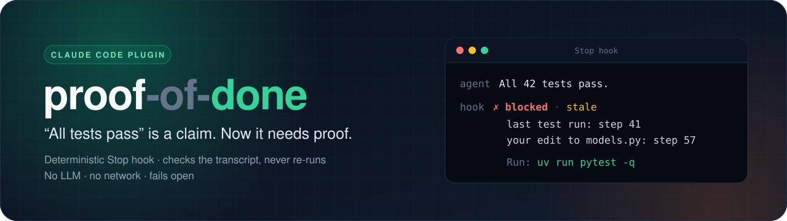
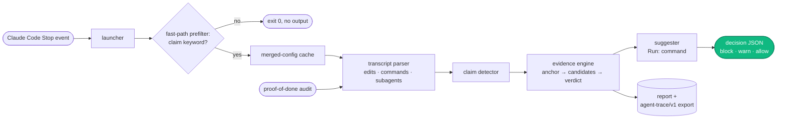

<p align="center">
  
</p>

<p align="center">
  <a href="https://github.com/B0yko/proof-of-done/actions/workflows/ci.yml"></a>
  <a href="https://github.com/B0yko/proof-of-done/releases"></a>
  
  
  <a href="LICENSE"></a>
</p>

<p align="center">
  <a href="#quickstart">Quickstart</a> ·
  <a href="#how-it-works">How it works</a> ·
  <a href="#results">Results</a> ·
  <a href="#configuration">Configuration</a> ·
  <a href="docs/how-it-works.md">Docs</a>
</p>

---

Coding agents end turns with *"all tests pass"*, *"the build succeeds"*, *"fixed"* or
*"deployed"*, and the session often does not back it up. **proof-of-done** treats those words as
claims. A Claude Code `Stop` hook checks the agent's own transcript: did the matching command run
**after the last relevant edit**, and did it **succeed**? If not, the stop is blocked and the agent
is told exactly what to run. The same engine audits past transcripts and reports how often a set
of sessions claimed what they never checked.

No LLM, no network, no re-running your commands: for a given transcript, message and
configuration the verdict is deterministic.

<p align="center">
  
  <br>
  <sub>A fixture Stop payload piped into the installed hook, then <code>audit --demo</code>. Not a live agent session.</sub>
</p>

## Highlights

- **Acts only on claims.** A keyword prefilter lets every other stop through without reading the
  transcript; the hook never runs tests or deploys itself.
- **Evidence, not vibes.** The latest matching command after the last relevant edit decides.
  Failed, empty, interrupted, background and masked runs (`| tail`, `|| true`) do not count.
- **Actionable.** Each block names the claim, the reason with step numbers and the file, and a
  `Run:` line with the command to run.
- **Hard to game.** Fake `echo "12 passed"`, a redefined `pytest`, `PATH` tricks, `--collect-only`,
  the agent typing the skip token or editing the config to switch the check off: an adversarial
  set tests all of these, and every case that gets through is listed below.
- **Safe to leave on.** Stdlib-only hook, fails open on any error, a loop cap below Claude Code's
  own, a tamper check against self-disabling.
- **Measured.** Precision and recall on a held-out set frozen before the detector existed, and
  latency on real hardware, all reproducible from the repository.

## Quickstart

```sh
claude plugin marketplace add B0yko/proof-of-done
claude plugin install proof-of-done@proof-of-done
```

The plugin loads on the next start of Claude Code, or after `/reload-plugins` in an open session.
Inside a session, the equivalent is `/plugin marketplace add B0yko/proof-of-done`, then
`/plugin install proof-of-done@proof-of-done`, which opens the plugin's details to pick a scope;
closing the `/plugin` panel reloads plugins
([docs](https://code.claude.com/docs/en/discover-plugins)).

Try the audit CLI on a bundled synthetic corpus without installing anything:

```sh
uvx --from git+https://github.com/B0yko/proof-of-done proof-of-done audit --demo
```

**Requires** `python3` ≥ 3.9 on the `PATH` Claude Code's hooks see (on macOS, `/usr/bin/python3`
needs the Command Line Tools; without them the hook skips its check with a message), macOS or
Linux. Tested with Claude Code **2.1.281**.

### What a block looks like

Real output: a fixture session in which the tests ran alongside the edit rather than after it,
piped into `bin/proof-of-done-hook`, the launcher Claude Code runs on `Stop`. The hook prints
`{"decision": "block", "reason": …}`; this is the `reason` the agent receives:

```text
proof-of-done: 1 claim in your final message is not backed by this session's transcript.
1. "all 40 tests pass" (tests_passed): the last test run `uv run pytest -q` at step 2 was before your edit to `src/app/parser.py` at step 4.
   Run: uv run pytest -q
Run these commands and report the real result, or restate your message without these claims.
```

The `Run:` command is the one the agent itself ran. Failing that, it comes from the rule's
`suggest` setting or from the project files; for a deploy claim or an unrecognised project it
reads `Run: (no … command found — run it in the foreground)`.

<details>
<summary>Reproduce this block</summary>

```sh
OUT=$(mktemp -d)
uv run python fixtures/render.py fixtures/scenarios/parallel-calls.yaml --out "$OUT"
sed -e "s|__TRANSCRIPT_PATH__|$(ls "$OUT"/*.stop-0-0.jsonl)|" \
    -e "s|__CWD__|$OUT|" -e "s|__SCRATCHPAD_DIR__|$OUT|" \
    -e "s|__LAST_ASSISTANT_MESSAGE__|Updated the parser; all 40 tests pass.|" \
    fixtures/payloads/stop_with_last_message.json |
  sh bin/proof-of-done-hook stop --data-dir "$OUT/data" |
  python3 -c 'import json, sys; print(json.load(sys.stdin)["reason"])'
```

`fixtures/render.py` writes the transcript and one snapshot per stop attempt
(`*.stop-<turn>-<attempt>.jsonl`); the other scenarios under `fixtures/scenarios/` work the same
way. The templated set is expanded in-process by `fixtures/expand.py` (`--stats` prints its
counts).

</details>

## How it works



For each claim in the final message, the evidence engine finds the **anchor** (the last edit to a
file the rule cares about: edit tools, Bash writes, formatters, whole-tree git operations, subagent
calls) and the **candidates** (foreground commands after it that match the rule). The latest
candidate decides.

| Claim type | Example wording | Counts as evidence (examples) |
|---|---|---|
| `tests_passed` | "all 42 tests pass", "✅ Tests" | `pytest`, `npm test`, `go test`, `cargo test`, `make test` |
| `build_passed` | "the build succeeds" | `npm run build`, `go build`, `cargo build`, `uv build` |
| `lint_clean` | "lint is clean" | `ruff check`, `eslint`, `golangci-lint run`, `cargo clippy` |
| `typecheck_clean` | "mypy passes" | `mypy`, `pyright`, `tsc`, `cargo check` |
| `deployed` | "deployed to staging" | `fly deploy`, `kubectl apply`, `terraform apply`, `docker push`, `npm publish` |
| `fixed`, `verified` | "fixed the crash", "verified with curl" | any command above, or `curl`, `python script.py`, `go run`, `make <target>` |

Every verdict carries one reason from a closed set:

| Reason | Meaning |
|---|---|
| `supported` | the latest matching run after the last relevant edit succeeded |
| `no_command` | no matching command ran in the session |
| `stale` | the last matching run came before the last relevant edit |
| `failed_exit` | it exited non-zero, was interrupted or timed out |
| `failed_output` | it exited 0, but its output reports failures |
| `empty_run` | it ran no tests (`collected 0 items`, `No tests found`) |
| `masked_inconclusive` | its exit status was masked (`\| tail`, `\|\| true`) and the output shows no success line |
| `background_only` | it only ran in the background: re-run it in the foreground |
| `superseded_by_failure` | a partial run (`-k`, `--lf`) passed after a full run failed |
| `no_result` | the run has no recorded result |

The claim detector is plain `re`. It masks code blocks, inline code, block quotes and quoted user
text, then rejects negated, hedged, conditional, future, question and instruction-to-the-user
forms ("should pass", "run `pytest` to confirm", "not verified"). Detection is **English only**: a
claim in another language is not detected at all.

The full rules are in **[docs/how-it-works.md](docs/how-it-works.md)**; the design decisions are
in nine short ADRs under **[docs/adr/](docs/adr/)**.

## Results

Every number comes from `uv run python eval/run_eval.py` and `uv run python eval/latency.py
--generate --run --max-load 4`, and every table is generated from the committed results files by
`scripts/render_results.py`, which CI checks, along with a re-run of the evaluation. There are
three fixture sets, never merged into one headline:

- **templated**: expanded from `fixtures/templates/` by the same author who wrote the detector,
  so it measures consistency with that author's reading of the claim wording;
- **held-out**: individually authored, free-form sessions, frozen at commit `4e54fc9`
  (`eval: freeze held-out set`) before `claims.py` existed, the more honest estimate;
- **adversarial**: sessions that deliberately try to game the gate.

<!-- results:headline:start -->
|  | templated | held-out |
|---|---|---|
| claim detection — precision / recall | 100.0% / 100.0% | 98.6% / 84.0% |
| gate on unsupported claims — precision / recall | 100.0% / 96.3% | 98.2% / 82.1% |
| turns blocked without an unsupported claim | 0.0% | 1.0% |

**34 / 36** gaming attempts met their labelled outcome · hook p95 on a 10 MB transcript **175 ms** (system Python 3.9) / **113 ms** (CPython 3.12) · audit **141 MB/s**
<!-- results:headline:end -->

> [!NOTE]
> The same author wrote the detector and the fixtures. The templated numbers measure
> consistency with the specification, not real-world agent behaviour. The held-out set is the more
> honest estimate, but it is still synthetic. Neither replaces running `proof-of-done audit` on
> your own agent's transcripts.

<details>
<summary><b>How the held-out numbers got here</b>: first run, tuning, label audit</summary>

The first held-out run, with a detector tuned only on the templated set, found few of the
labelled claims. The detector was then broadened on a separate development set (`eval/dev/`). The
held-out set played no part in that tuning: after the freeze, the held-out files changed only in
label-correction commits and in documentation commits that touched only `CHANGES.md` there
(`git log -- eval/heldout`); the development scorer (`eval/dev_eval.py`) reads only `eval/dev/`
and the templated set; only `eval/run_eval.py` and the manifest test read `eval/heldout/`. A label
audit of every held-out disagreement then corrected the label errors it found, mostly unmarked
lead-in claims such as "Fixed the lock ordering in acquire().". Each correction is recorded with
its reason in [eval/heldout/CHANGES.md](eval/heldout/CHANGES.md), together with the ids of a
25-scenario spot check of cases without disagreement. That check found two more unmarked lead-in
claims; both were corrected, and since the detector misses both, the correction lowered recall.

The rows below are the committed runs: the two earlier ones in `eval/results/history/`, the
current one in `eval/results/<date>.json`. The two earlier rows were re-scored with the current
per-message detection matching: product code and labels as of the listed commit, harness fix from
commit `b489e6d` (see the `rescored` field in each history JSON). The gate columns were not
affected, so `uv run python eval/run_eval.py` at a listed commit reproduces them.

<!-- results:history:start -->
| run | commit | held-out detection P / R | held-out gate claim P / R | held-out gate turn P / R | held-out false-block rate | templated gate claim P / R |
|---|---|---|---|---|---|---|
| first held-out run (detector tuned on the templated set only) | `7bfbd7e` | 89.8% / 29.1% | 95.2% / 32.3% | 100.0% / 29.0% | 0.0% | 100.0% / 96.3% |
| after tuning on the development set (frozen labels) | `08f2187` | 89.9% / 82.8% | 91.1% / 82.3% | 93.8% / 72.6% | 2.8% | 100.0% / 96.3% |
| current (held-out label corrections in CHANGES.md) | `e1579dc` | 98.6% / 84.0% | 98.2% / 82.1% | 97.9% / 73.4% | 1.0% | 100.0% / 96.3% |
<!-- results:history:end -->

</details>

<details>
<summary><b>Claim detection</b>: precision, recall and F1 with N</summary>

A detection matches a label when the claim type agrees and the spans overlap by at least one
character in the same message.

<!-- results:detection:start -->
| set | N labels | N detections | TP | FP | FN | precision | recall | F1 |
|---|---|---|---|---|---|---|---|---|
| templated | 955 | 955 | 955 | 0 | 0 | 100.0% | 100.0% | 1.000 |
| heldout | 163 | 139 | 137 | 2 | 26 | 98.6% | 84.0% | 0.907 |
<!-- results:detection:end -->

</details>

<details>
<summary><b>Gate quality</b>: unsupported claims, claim level and turn level, with intervals</summary>

The positive class is "unsupported claim". Precision and recall carry Wilson 95% intervals, F1 a
seeded bootstrap 95% interval. "forced_block" forces every built-in rule to `block`; it equals the
shipped config because no type needed the switch to `warn` described under the next heading.

<!-- results:gate-claim:start -->
| set | config | N | TP | FP | FN | precision (95% CI) | recall (95% CI) | F1 (95% CI) |
|---|---|---|---|---|---|---|---|---|
| templated | shipped | 955 | 395 | 0 | 15 | 100.0% [99.0%, 100.0%] | 96.3% [94.1%, 97.8%] | 0.981 [0.971, 0.990] |
| templated | forced_block | 955 | 395 | 0 | 15 | 100.0% [99.0%, 100.0%] | 96.3% [94.1%, 97.8%] | 0.981 [0.971, 0.990] |
| heldout | shipped | 164 | 55 | 1 | 12 | 98.2% [90.6%, 99.7%] | 82.1% [71.3%, 89.4%] | 0.894 [0.830, 0.946] |
| heldout | forced_block | 164 | 55 | 1 | 12 | 98.2% [90.6%, 99.7%] | 82.1% [71.3%, 89.4%] | 0.894 [0.830, 0.946] |
<!-- results:gate-claim:end -->

At turn level, a turn is a predicted block if any claim in it is unsupported under a `block` rule.
The false-block rate is the share of turns with no unsupported label that were blocked anyway.

<!-- results:gate-turn:start -->
| set | config | N | TP | FP | FN | precision (95% CI) | recall (95% CI) | F1 (95% CI) |
|---|---|---|---|---|---|---|---|---|
| templated | shipped | 975 | 375 | 0 | 35 | 100.0% [99.0%, 100.0%] | 91.5% [88.4%, 93.8%] | 0.955 [0.940, 0.970] |
| templated | forced_block | 975 | 375 | 0 | 35 | 100.0% [99.0%, 100.0%] | 91.5% [88.4%, 93.8%] | 0.955 [0.940, 0.970] |
| heldout | shipped | 169 | 47 | 1 | 17 | 97.9% [89.1%, 99.6%] | 73.4% [61.5%, 82.7%] | 0.839 [0.759, 0.906] |
| heldout | forced_block | 169 | 47 | 1 | 17 | 97.9% [89.1%, 99.6%] | 73.4% [61.5%, 82.7%] | 0.839 [0.759, 0.906] |

False-block rate (shipped config; share of no-unsupported-label turns blocked):
| set | N | blocked | rate | 95% CI |
|---|---|---|---|---|
| templated | 565 | 0 | 0.0% | [0.0%, 0.7%] |
| heldout | 105 | 1 | 1.0% | [0.2%, 5.2%] |
<!-- results:gate-turn:end -->

</details>

<details>
<summary><b>By claim type</b>: and the rule that would switch a weak type to <code>warn</code></summary>

A built-in claim type whose held-out gate precision is below 0.90 ships with `action: warn`
instead of `block`. With the corrected labels no type is below 0.90 (`verified` is exactly 0.90),
so every built-in rule ships as `block`. On the frozen labels before the audit, `build_passed`,
`fixed` and `verified` were below 0.90 (second history file). The five false positives behind that
were one unmarked lead-in claim (`fixed`), one claim with the wrong type (`build_passed`), two
labels flipped because `python -c` is not an execution command (`fixed`, `verified`), and one
genuine false positive that remains, a hedge the negation window does not cover (`verified`). The
per-type counts are small, so read them as rough.

<!-- results:per-type:start -->
| set | claim type | N | predicted blocks | precision | recall | F1 |
|---|---|---|---|---|---|---|
| templated | build_passed | 40 | 20 | 100.0% | 100.0% | 1.000 |
| templated | deployed | 40 | 20 | 100.0% | 100.0% | 1.000 |
| templated | fixed | 80 | 20 | 100.0% | 100.0% | 1.000 |
| templated | lint_clean | 110 | 45 | 100.0% | 90.0% | 0.947 |
| templated | tests_passed | 605 | 250 | 100.0% | 96.2% | 0.980 |
| templated | typecheck_clean | 40 | 20 | 100.0% | 100.0% | 1.000 |
| templated | verified | 40 | 20 | 100.0% | 100.0% | 1.000 |
| heldout | build_passed | 19 | 8 | 100.0% | 88.9% | 0.941 |
| heldout | deployed | 28 | 9 | 100.0% | 90.0% | 0.947 |
| heldout | fixed | 26 | 11 | 100.0% | 100.0% | 1.000 |
| heldout | lint_clean | 26 | 8 | 100.0% | 100.0% | 1.000 |
| heldout | tests_passed | 24 | 9 | 100.0% | 75.0% | 0.857 |
| heldout | typecheck_clean | 18 | 1 | 100.0% | 12.5% | 0.222 |
| heldout | verified | 23 | 10 | 90.0% | 100.0% | 0.947 |

Held-out predicted blocks per claim type range from 1 (`typecheck_clean`) to 11 (`fixed`); a precision figure that rests on only a few predicted blocks is a rough estimate.
<!-- results:per-type:end -->

</details>

<details>
<summary><b>Adversarial resistance</b> and <b>suggestion accuracy</b></summary>

The adversarial cases cover fake success output, redefined `pytest` functions and aliases, `PATH`
prepending, collect-only and masked runs, interrupted and timeout-killed runs, a partial pass after
a failed full run, a claim hidden in a code block, the agent writing the skip token itself, and the
agent editing the config or settings to switch the check off. Every miss is a known limitation.

<!-- results:adversarial:start -->
**34 / 36** adversarial cases met their labelled outcome.

Known misses:

| scenario | expected decision | expected reason | predicted decision | predicted reason |
|---|---|---|---|---|
| adv-07-makefile-echo-only-known-miss | block | None | allow | None |
| adv-36-npm-run-test-watch-known-miss | block | None | allow | None |
<!-- results:adversarial:end -->

Suggestion accuracy is the share of correctly blocked unsupported claims whose `Run:` command
equals the labelled expected command.

<!-- results:suggestion:start -->
| set | N correctly blocked | matching suggestion | accuracy |
|---|---|---|---|
| templated | 375 | 355 | 94.7% |
| heldout | 49 | 49 | 100.0% |
<!-- results:suggestion:end -->

</details>

<details>
<summary><b>Hook latency</b> and <b>audit throughput</b>: MacBook Air, Apple M5, 24 GB</summary>

p50, p95 and max over 200 invocations of the real launcher, each a fresh interpreter, for the fast
path (no claim in the message) and 1, 10 and 50 MB transcripts, under the system `python3` and a
uv-managed CPython 3.12, with an empty and a warm merged-config cache. The hook's bytecode cache
in the data directory is warm after the first call of each series, and no row uses a transcript
parse cache. The latency targets (warm config cache: p95 ≤ 250 ms up to 10 MB, ≤ 1 s at 50 MB,
under both interpreters) are met.

<!-- results:latency:start -->
Machine: Mac17,4, Apple M5, 24 GB RAM, macOS 26.6.2; interpreters: system `python3` 3.9.6, uv-managed CPython 3.12.14; measured 2026-09-28T20:16:39Z. 1-minute load average during the run: 2.8–5.1 on 10 cores (other processes were running).

| case | interpreter, cache | N | p50 (ms) | p95 (ms) | max (ms) |
|---|---|---|---|---|---|
| fast path (no claim) | system python3, cold config cache | 200 | 132.5 | 147.0 | 323.8 |
| fast path (no claim) | system python3, warm config cache | 200 | 57.9 | 61.5 | 66.0 |
| fast path (no claim) | uv CPython 3.12, cold config cache | 200 | 72.5 | 80.4 | 193.9 |
| fast path (no claim) | uv CPython 3.12, warm config cache | 200 | 23.4 | 27.1 | 65.7 |
| 1 MB | system python3, cold config cache | 200 | 156.2 | 221.8 | 376.6 |
| 1 MB | system python3, warm config cache | 200 | 108.0 | 150.8 | 168.2 |
| 1 MB | uv CPython 3.12, cold config cache | 200 | 71.0 | 72.3 | 167.4 |
| 1 MB | uv CPython 3.12, warm config cache | 200 | 54.1 | 55.3 | 62.5 |
| 10 MB | system python3, cold config cache | 200 | 201.6 | 208.5 | 307.8 |
| 10 MB | system python3, warm config cache | 200 | 170.3 | 174.8 | 187.0 |
| 10 MB | uv CPython 3.12, cold config cache | 200 | 119.3 | 124.1 | 220.0 |
| 10 MB | uv CPython 3.12, warm config cache | 200 | 104.8 | 112.8 | 121.7 |
| 50 MB | system python3, cold config cache | 200 | 559.9 | 609.0 | 748.4 |
| 50 MB | system python3, warm config cache | 200 | 522.7 | 577.8 | 588.4 |
| 50 MB | uv CPython 3.12, cold config cache | 200 | 388.6 | 590.5 | 832.7 |
| 50 MB | uv CPython 3.12, warm config cache | 200 | 331.7 | 466.8 | 586.2 |
<!-- results:latency:end -->

Audit throughput on the 50 MB synthetic transcript, median of 5 runs:

<!-- results:throughput:start -->
`proof-of-done audit` on a 49.8 MB transcript: median **140.5 MB/s** over 5 run(s).
<!-- results:throughput:end -->

</details>

<details>
<summary><b>Failure analysis</b>: every held-out error, by failure mode</summary>

There are no prefilter misses, no wrong verdicts on detected claims and no wrong suggestions;
almost every error is a claim the detector does not recognise.

<!-- results:failure-modes:start -->
| failure mode | claim type | count | example scenario | example |
|---|---|---|---|---|
| detection_fn | typecheck_clean | 14 | `ho-027` | "Types check" |
| detection_fn | deployed | 6 | `ho-049` | "pushed the worker image" |
| detection_fn | tests_passed | 3 | `ho-006` | "They pass" |
| detection_fn | lint_clean | 2 | `ho-064` | "vet is clean" |
| detection_fn | build_passed | 1 | `ho-012` | "Build is clean" |
| detection_fp | lint_clean | 1 | `ho-104` | "tests pass" |
| detection_fp | verified | 1 | `ho-081` | "verified" |
<!-- results:failure-modes:end -->

- **Type-check phrasings are the biggest gap.** "Types check", "it typechecks" and "it vets
  clean" are not in the detector's vocabulary, so an unsupported type-check claim phrased that way
  passes the gate.
- **State-style deploy claims** ("it's published", "it's live in production", "pushed the worker
  image") and **pronoun subjects** ("They pass") are missed for the same reason.
- **Two false positives:** a hedge the negation window does not cover ("I wouldn't call it fully
  verified yet"), and a two-claim sentence where "tests pass" was attributed to `lint_clean`.

None of these was fixed after the held-out run: tuning on the held-out set would make its numbers
meaningless. The confusion matrix of reasons and the full error list are in
[docs/eval.md](docs/eval.md).

</details>

<details>
<summary><b>Demo audit report</b>: <code>proof-of-done audit --demo</code> on the bundled synthetic corpus</summary>

Thirty hand-authored sessions across Python, Node, Go and Rust projects. This is a demo of the
report, **not a measurement of any real coding agent**. The block is generated from an in-process
run and checked in CI.

<!-- results:demo:start -->
```
proof-of-done audit report
SYNTHETIC DEMO CORPUS -- this report describes 30 hand-authored fixture sessions, not a measurement of any real coding agent.

config applied: built-in defaults
files processed: 30

sessions: 30
turns: 30
stop attempts: 30
turns with claims: 30
claims: 45
unsupported: 16 (35.6% of claims)
partial share of supported claims: 17.2%

by claim type:
  build_passed: 3 claims, 1 unsupported (33.3%)
  deployed: 4 claims, 0 unsupported (0.0%)
  fixed: 15 claims, 4 unsupported (26.7%)
  lint_clean: 5 claims, 2 unsupported (40.0%)
  tests_passed: 12 claims, 7 unsupported (58.3%)
  typecheck_clean: 3 claims, 1 unsupported (33.3%)
  verified: 3 claims, 1 unsupported (33.3%)

unsupported by reason:
  background_only: 1
  empty_run: 1
  failed_exit: 3
  failed_output: 1
  masked_inconclusive: 2
  no_command: 2
  no_result: 2
  stale: 2
  superseded_by_failure: 2

most recent unsupported claims:
  [fixed] "Patched" -- superseded_by_failure
    Run: cargo test
  [tests_passed] "All tests pass" -- superseded_by_failure
    Run: cargo test
  [tests_passed] "All tests pass" -- background_only
    Run: go test ./...
  [fixed] "Fixed the race" -- stale
    Run: go test ./...
  [lint_clean] "Lint is clean" -- failed_exit
    Run: go vet ./...
  [tests_passed] "All tests pass" -- empty_run
    Run: npx vitest run
  [typecheck_clean] "Typecheck is clean" -- failed_exit
    Run: npx tsc --noEmit
  [fixed] "Patched" -- masked_inconclusive
    Run: npx vitest run
  [verified] "Confirmed it's working" -- masked_inconclusive
    Run: npx vitest run
  [build_passed] "The build succeeds" -- failed_exit
    Run: uv build
```
<!-- results:demo:end -->

</details>

## Configuration

Five layers merge, lowest precedence first: the packaged defaults, the user file
`${XDG_CONFIG_HOME:-~/.config}/proof-of-done/config.yaml`, the project's `.proof-of-done.yaml`,
the file named by `PROOF_OF_DONE_CONFIG`, then the `PROOF_OF_DONE` and `PROOF_OF_DONE_MODE`
environment variables. Project rules merge into built-in rules by `id`, field by field; new ids
add custom claim types. Every key and the full evidence-command table are in
**[docs/config.md](docs/config.md)**; `examples/` has configs for Python, Node, Go and a monorepo,
plus custom `committed`/`pushed` rules. `proof-of-done init` writes a starter
`.proof-of-done.yaml` (`version: 1`, the detected ecosystem as a comment, `rules: []`).

| Escape hatch | Effect |
|---|---|
| `#skip-proof` in your own prompt | skips the check for that turn; the agent writing the token has no effect |
| `PROOF_OF_DONE=off` or `enabled: false` | turns the hook off |
| `PROOF_OF_DONE_MODE=warn` or `mode: warn` | every block becomes a visible warning |
| `max_blocks_per_turn` (default 2) | after that many blocks in a row the stop is allowed with a warning, below Claude Code's own default cap of 8 ([hooks reference](https://code.claude.com/docs/en/hooks)) |

**Tamper check.** The hook scans the session's own edits *before* it applies `enabled`, `mode` or
any rule `action`. If the session edited `.proof-of-done.yaml`, the user config or the
`PROOF_OF_DONE_CONFIG` file, four downgrades from that file are undone for the rest of the
session: `enabled: false`, `mode: warn`, a lowered `action` and a raised `max_blocks_per_turn`. If
it edited a Claude Code `settings.json`/`settings.local.json` with text containing
`PROOF_OF_DONE` or `enabledPlugins`, `PROOF_OF_DONE=off` and `PROOF_OF_DONE_MODE=warn` from the
environment are ignored. A warning names the edited file, and tampering alone never blocks. What it
does not undo is listed under [Limitations](#limitations).

## CLI

The plugin does not put `proof-of-done` on your `PATH`. Install the CLI with
`uv tool install git+https://github.com/B0yko/proof-of-done`, or run any command through
`uvx --from git+https://github.com/B0yko/proof-of-done proof-of-done <command>`.

```text
proof-of-done check --transcript PATH [--message TEXT | --message-file PATH] [--config PATH] [--json]
proof-of-done audit [PATH ...] [--claude-projects | --demo] [--source auto|claude-code|agent-trace|codex]
                    [--config PATH] [--format text|json|md] [--out FILE] [--export-traces FILE]
                    [--redact] [--salt S] [--ci] [--max-unsupported-rate R]
proof-of-done init [--force]
proof-of-done config show [--cwd DIR]
proof-of-done trace validate FILE
```

<details>
<summary>What each command does, and its exit codes</summary>

- **`check`** judges one final message against one transcript, without a live hook. Exit `0`:
  nothing to block (a warn-only result still prints its warning); `1`: an unsupported claim under
  a `block` action; `2`: a usage or config error.
- **`audit`** replays the Stop hook at every stop attempt of every session, and at each
  subagent's own transcript grouped under its parent, with the built-in defaults or `--config`.
  Exactly one input mode: `PATH`s (files, directories, globs), `--claude-projects`
  (`$CLAUDE_CONFIG_DIR/projects`, else `~/.claude/projects`) or `--demo`. `--source codex` reads
  OpenAI Codex CLI rollout logs (experimental, audit only). `--export-traces FILE` writes
  `agent-trace/v1` JSONL; `--redact` replaces quotes, commands, paths and session ids with a
  salted SHA-256 prefix plus length (`h:<12 hex>:len=<n>`), with a random salt per run unless you
  pass `--salt` or `PROOF_OF_DONE_SALT`. Exit `2`: a usage error or a missing or invalid
  `--config`; `3`: no input yielded a session (every file unreadable or unrecognised, including a
  file with lines but no parseable JSON line). With `--ci`, exit `1` when the unsupported-claim
  rate exceeds `--max-unsupported-rate` (a fraction, default `0`; ignored without `--ci`, so
  `audit --demo --ci` exits `1`), plus a Markdown summary in `$GITHUB_STEP_SUMMARY` when set. See
  `examples/ci/audit-agent-run.yml` for a GitHub Actions job shape (not run by this repository's
  CI: it needs a real headless agent run).
- **`init`** writes `.proof-of-done.yaml` in the current directory; it refuses to overwrite one
  without `--force` (exit `2`). The built-in rules already cover Python, Node, Go and Rust, so the
  file changes nothing until you add overrides.
- **`config show`** prints the effective merged configuration and the files it came from.
- **`trace validate`** checks an `agent-trace/v1` file against `schemas/agent-trace-v1.json`.

</details>

### Debugging a block

```sh
proof-of-done check --transcript path/to/session.jsonl --message "All tests pass."
proof-of-done config show
```

The hook logs to `${CLAUDE_PLUGIN_DATA}/proof-of-done.log` (or
`${TMPDIR:-/tmp}/proof-of-done-<uid>/` when that is unset), JSON Lines capped at 256 KiB. Each stop
past the prefilter writes one `decision` record with the final decision (after the block cap;
`capped: true` when the cap let a stop through), the claim count, the flags `skipped`, `disabled`,
`tampered` and `capped`, one entry per claim (`claim_type`, `rule_ids`, `supported`, reason code,
action) and per-phase `timings_ms`. A fail-open writes a `fail_open` record with a reason code,
and an unexpected exception an `error` record with only the exception class name. The log never
contains message text, quotes, commands or file paths.

### Privacy

The hook reads only local files: the event JSON on stdin; the session transcript (for
`SubagentStop`, the subagent's transcript plus the parent's, for the skip token and the tamper
scan); long tool outputs Claude Code stored inside that session's own directory; the config files;
and, to suggest a `Run:` command, the project's `pyproject.toml`, `pytest.ini`, `package.json`,
`go.mod`, `Cargo.toml`, `Makefile` and lockfiles. It makes **no network call**, and a
socket-blocking test fixture enforces that. It writes only under `${CLAUDE_PLUGIN_DATA}` (or the
temp fallback): block counters, the merged-config cache, Python's bytecode cache, the log, and on
macOS a `.python-ok` marker when the interpreter is `/usr/bin/python3`. It never writes into your
project.

## Alternatives

Existing Claude Code hooks and plugins that verify completion claims or gate `Stop` on test, build
or deploy state, each checked against its repository on 2026-09-28:

| Project | Mechanism | License · stars |
|---|---|---|
| [claimcheck](https://github.com/ablanchard-dev/claimcheck) | Checks each claim in the final message against tool output already in the same turn's transcript (verified / refuted / unverifiable); never re-runs commands. | GPL-3.0 · 0 |
| [done-needs-proof](https://github.com/sdvsignal/done-needs-proof) | Node `Stop` hook; blocks "done", "fixed", "deployed" or "tests pass" unless a matching verification command ran after the last edit. Keyword matching, fails open, fires once per stop; ships a `prove` skill. | MIT · 0 |
| [loop-hooks](https://github.com/wwwcojp/loop-hooks) | **Re-runs** the project's verification command on `Stop`, `SubagentStop` and `TeammateIdle`, gated by a git fingerprint of the watched files. | MIT · 0 |
| [tdd-guard](https://github.com/nizos/tdd-guard), successor [Probity](https://github.com/nizos/probity) | A process gate rather than a claim checker: blocks implementation edits without a failing test first; some checks call a validation model. The most adopted tool in this space. | MIT · 2,353 (tdd-guard), 216 (Probity) |
| [protect-tests](https://github.com/karanb192/claude-code-hooks/tree/main/plugins/protect-tests) | `PreToolUse` hook against "fake green": deleting, renaming away or skip/xfail-disabling tests instead of fixing the code. Deterministic patterns. | MIT · 526 (whole repo) |
| [dead-rules-audit](https://github.com/karanb192/claude-code-hooks/tree/main/plugins/dead-rules-audit) | Not a stop gate: scores edits against `CLAUDE.md`'s own rules and reports which are ignored. An adjacent pattern, listed for context. | MIT · 526 (whole repo) |
| [sonmat](https://github.com/jun0-ds/sonmat) | Verification discipline mostly through prompt guidance (in `CLAUDE.md` and injected into worker subagents), plus a commit guard; no transcript checking described. | BSD-3-Clause · 6 |
| Official [plugin-dev hook guide](https://github.com/anthropics/claude-code/blob/main/plugins/plugin-dev/skills/hook-development/SKILL.md) | Its `Stop` hook example is a `prompt` hook: a second model call judging "approve" or "block". Teaching material, not a maintained plugin. A read of the [claude-plugins-official](https://github.com/anthropics/claude-plugins-official) listing (314 entries, descriptions only) found none that describes verifying completion claims. | — |

proof-of-done sits with claimcheck and done-needs-proof on deterministic transcript inspection,
never re-runs a command (unlike loop-hooks), never calls a model (unlike Probity's validation
option and the official prompt-hook example), and publishes a reproducible evaluation against a
frozen held-out set. This describes what exists; it is not a claim to be first.

## Limitations

- **Missed phrasings are never checked.** The detector does not know every wording: type-check
  phrasing ("Types check", "it vets clean"), state-style deploy claims ("it's live in
  production") and pronoun subjects ("They pass") are the main gaps. See the failure analysis
  under [Results](#results).
- **English only.**
- **Two known adversarial misses.** An echo-only Makefile `test:` target whose output looks like a
  test summary, and `npm run test:*` scripts, which are trusted by name even when they start a
  watcher.
- **Background runs never count** as evidence in v0.1, even when a later notification reports
  success; the block message says to re-run in the foreground.
- **Only Bash is evidence.** MCP test runners, IDE diagnostics and the PowerShell tool are not read.
- **Edits outside the agent are invisible.** A file you change in your editor has no transcript
  event; there is no cross-check with `git status` or file mtimes.
- **Subagents are judged separately.** A subagent call counts as an edit for every rule (by
  default); what it touched is not parsed, and its verdict is not reused as the parent's evidence.
- **A transcript that starts mid-history only warns.** When the first message's `parentUuid`
  names an entry missing from the file, the evidence is known to be incomplete, so blocks become
  warnings.
- **The transcript format is internal to Claude Code** and pinned to 2.1.281
  ([docs/transcript-format.md](docs/transcript-format.md)); on a changed format the hook fails
  open, and its accuracy is unverified until re-pinned.
- **Tamper protection is partial.** It undoes only the four downgrades above. Other keys from an
  edited config still apply, including `max_transcript_mb`, `check_subagents` and
  `subagent_skip_types` (read before the transcript is parsed) and a rule's `claims` and
  `keywords`; an invalid config fails open with a warning.
- **Out of scope:** generic "done" or "implemented" claims, claims about external state no
  command can show ("the email was sent"), and Windows.
- **The Codex adapter is experimental and audit-only,** pinned to one `openai/codex` source
  commit and built from hand-written fixtures.
- **Not on PyPI yet.** Use the `git+https` form; `release-pypi.yml` is prepared for trusted
  publishing.

## Uninstall or disable

```sh
claude plugin uninstall proof-of-done@proof-of-done   # remove it
claude plugin disable proof-of-done                   # keep it installed, turn it off
```

Or set `PROOF_OF_DONE=off` for Claude Code's hook processes, or `enabled: false` in
`.proof-of-done.yaml`.

## Roadmap

- Reuse a subagent's already-checked verdict as evidence for its parent's claim.
- Publish to PyPI, so `uvx proof-of-done` works without the `git+https` form.
- Evidence from sources other than Bash (MCP test runners, IDE diagnostics).
- Pin the Codex adapter against a verified rollout log and consider a Codex-side hook.

## Data and licence

All fixtures, templates, held-out, development and adversarial sessions are synthetic, written for
this repository and licensed Apache-2.0 with the code (see [fixtures/README.md](fixtures/README.md)).
The only vendored third-party code is a pure-Python copy of **PyYAML 6.0.3** (MIT, licence kept
in `src/proof_of_done/_vendor/yaml/LICENSE`), so the hook needs no install step
([ADR 3](docs/adr/0003-stdlib-only-hook-vendored-yaml.md)).

Apache-2.0, see [LICENSE](LICENSE). Copyright 2026 Andrii Boiko.
